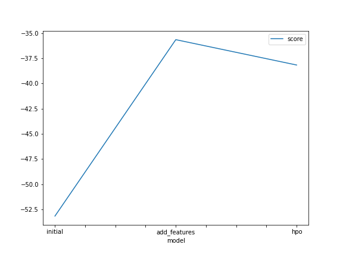
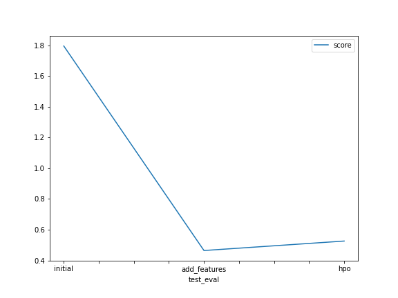

# Report: Predict Bike Sharing Demand with AutoGluon Solution
#### Mohsen Mahmoodzadeh

## Initial Training
### What did you realize when you tried to submit your predictions? What changes were needed to the output of the predictor to submit your results?
I got an error in predicting step:
```
KeyError: "2 required columns are missing from the provided dataset to transform using AutoMLPipelineFeatureGenerator. Missing columns: ['casual', 'registered']"
```

So I removed the two columns metioned above from the training data and It works now. 

### What was the top ranked model that performed?
The top ranked model is WeightedEnsemble_L3 which got -53.150441 score_val in training and 1.7958 score in testing phase. 

## Exploratory data analysis and feature creation
### What did the exploratory analysis find and how did you add additional features?
After plotting the features of the dataset, I can see the distribution and the structure of the features. Some of them such as datetime didn't give any useful information. So splitting the datetime into smaller units got a candidate to get more illustrative information. After the breaking it into samller parts, we got a better visualization from each part which gave more sense about the distribution of the date and the time of observations.

### How much better did your model preform after adding additional features and why do you think that is?
After feature engineering, I got from 1.7958(previous model score) to 0.46465 score which means we have a better model. The main reason is about the feature engineernig and data preprocessing. We extract some more realistic feature from some old ones, we also have do encoding on categorical features to treat their values as categorical quantities not numeric ones, and we also have applied feature scaling for some features to avoid the effect of very large or very small numbers. 

## Hyper parameter tuning
### How much better did your model preform after trying different hyper parameters?
For me it didn't get better. I got from 0.45465 to 0.52633 score which means we got a little worse model than before.

### If you were given more time with this dataset, where do you think you would spend more time?
I don't think so. The key point is about the quality of the data not the quality of the model. When we have a not big enough data which may haven't rich features, We'll face with some unavoidable limitation on model performance. I think we have data-centric limitations for this problem and overworking on model improvement won't give a remarkable outcome.

### Create a table with the models you ran, the hyperparameters modified, and the kaggle score.
|model|hpo1|hpo2|hpo3|score|
|--|--|--|--|--|
|initial|default vals|default vals|default vals|1.7958|
|add_features|default vals|default vals|default vals|0.46465|
|hpo|'GBM: num_boost_round: 100'|'GBM: num_boost_round: 200'|'NN: {num_epochs: 10, learning_rate: 1e-4, 1e-2, activation: relu, softrelu, tanh}'|0.52633|

### Create a line plot showing the top model score for the three (or more) training runs during the project.



### Create a line plot showing the top kaggle score for the three (or more) prediction submissions during the project.



## Summary
TODO: Add your explanation
